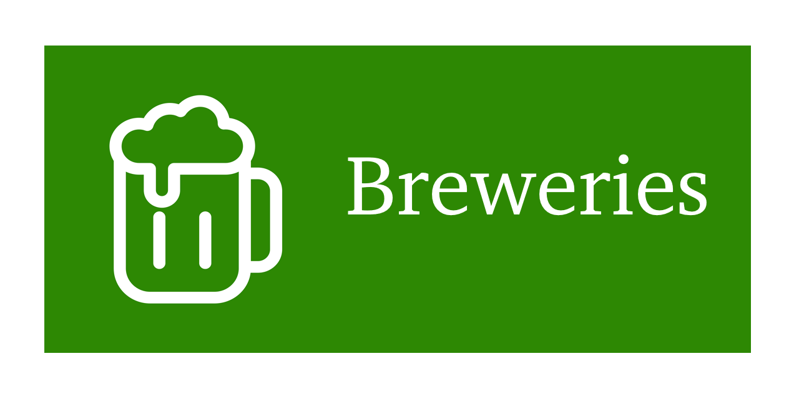
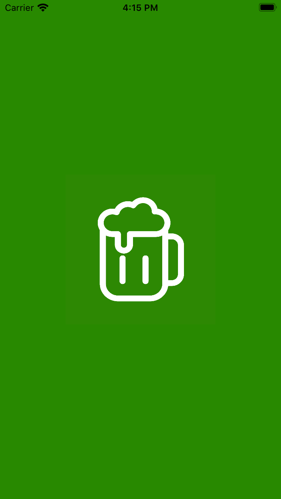
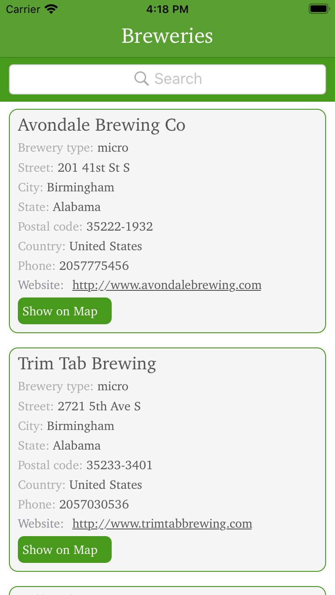
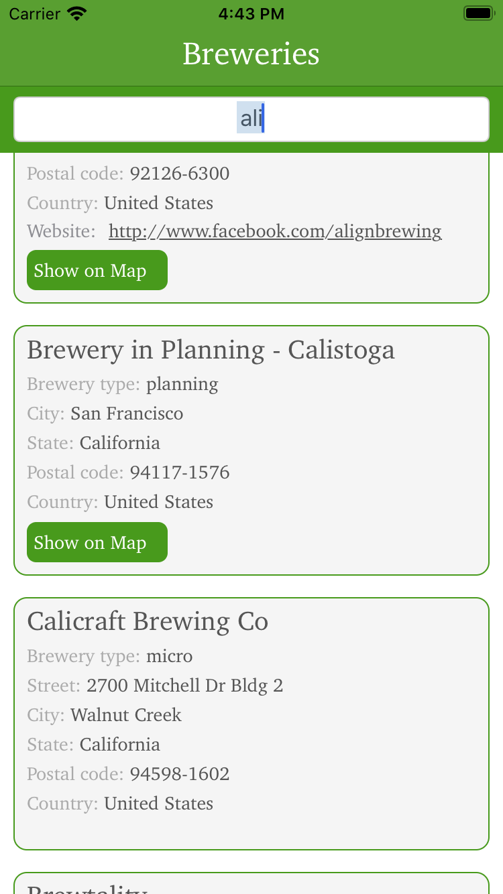
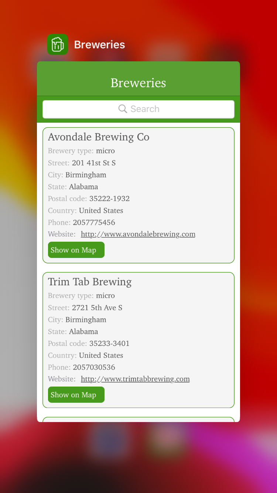
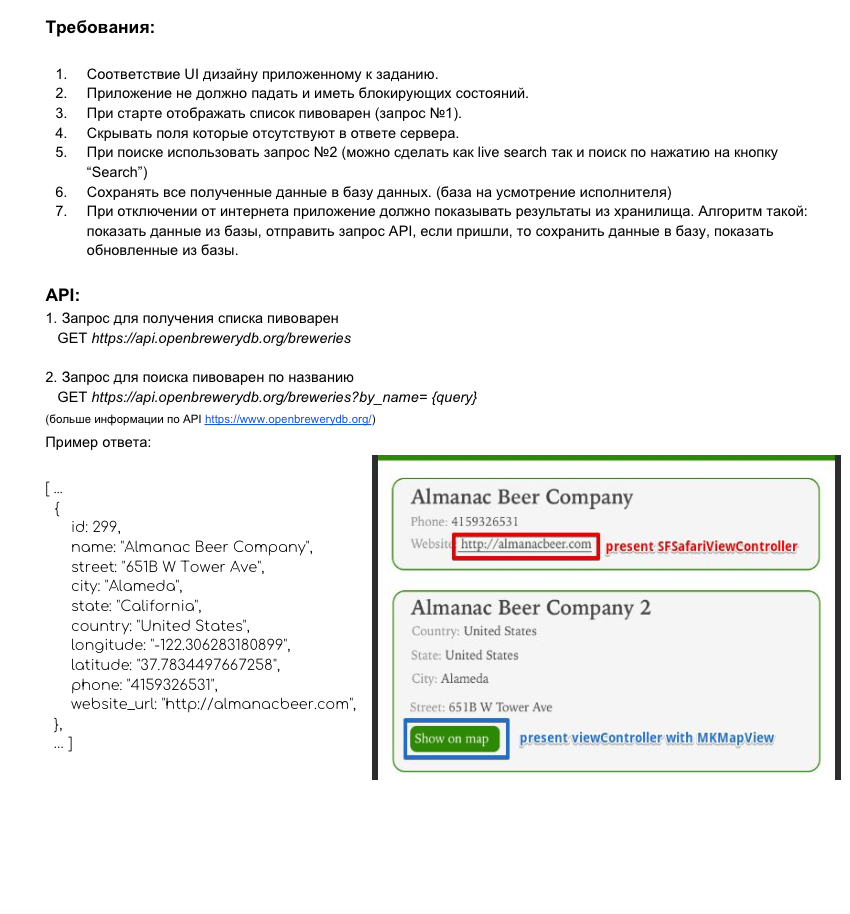
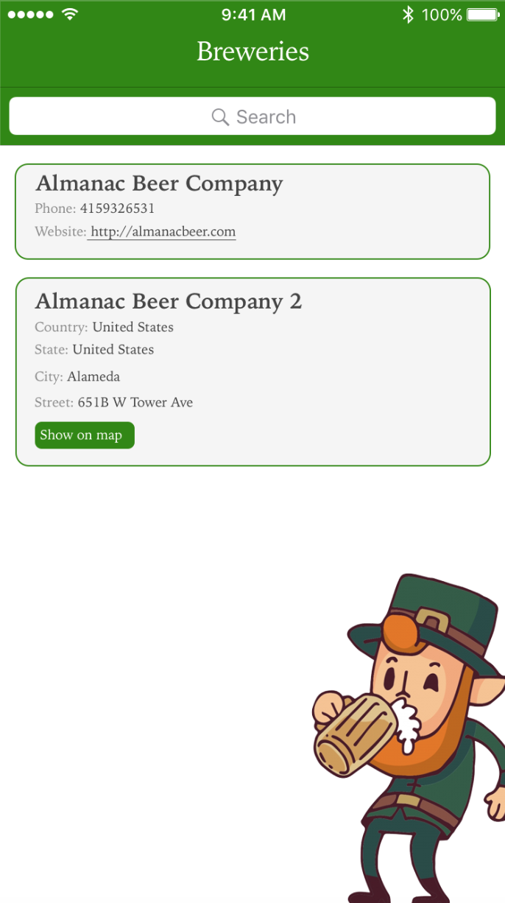

# Breweries app

    
    
    
    

# Requirements

    
    

# Installation
1. Install Cocoapods: sudo gem install cocoapods
2. Update pods in folder: pod update
3. Build project from Xcode.
4. Install [Swift-Realm](https://realm.io/docs/swift/latest/)